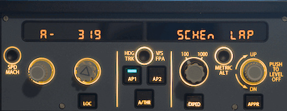
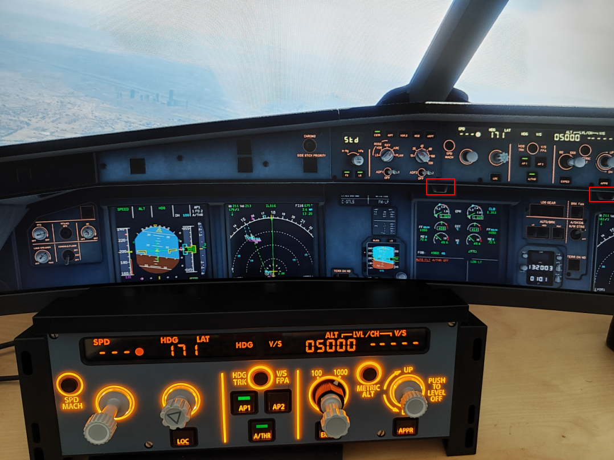

# Winwing Fcu
This script is to use Winwing A320 FCU on Linux (maybe Mac-OS) with X-Plane
Tested with:
 * XP12 under linux (debian trixie)
 * XP12 under MacOs (Sequoia 15.0.1)
 * Toliss A319, A320Neo, A321 Neo

## Installation

#### Debian based system
1. clone the repo where you want
2. copy `udev/71-winwing.rules` to `/etc/udev/rules.d`  
`sudo cp udev/71-winwing.rules /etc/udev/rules.d/`
3. install dependencies (on debian based systems)  
`sudo aptitude install python3-usb`

#### MAC-OS

1. clone the repo where you want
2. install homebrew
3. install dependencies
`python3 -m pip install pyusb`
4. brew install libusb
4. start script with sudo: `sudo python3 ./winwing_fcu.py`

## Use FCU
1. start X-Plane
2. load Toliss A319
3. start script with `./winwing_fcu.py`
4. enjoy flying (and report bugs :-)  )

Change brightness with the two brightness knobs in the cockpit.

## developer documentation
See [documention](./documentation/README.md) for developers

## Notes
Use at your own risk. Updates to the FCU can make the script incompatible.
TODO: The data sent in the USB protocol by SimApp Pro has not yet been fully implemented, only to the extent that it currently works.
