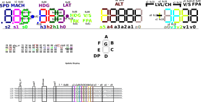
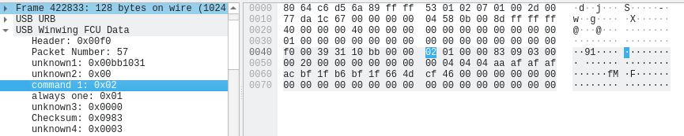

# Documentation for developers

## sniff winwing usb protocol

I use Linux as host system and Windows in virt-manager that runs SimApp pro. Wirshark runs in Linux to sniff usb transfer.

## wireshark

to start sniffing:
1. sudo mount -t debugfs / /sys/kernel/debug
2. sudo modprobe usbmon
3. sudo setfacl -m u:$USER:r /dev/usbmon*
4. wireshark

I wrote a [dissector ](..//wireshark_winwing_dissector.lua) for wirehark to parse the winwing protocol. Copy it to `~/.local/lib/wireshark/plugins/`to let wireshark use it. It will be use automtically for received usb data.

